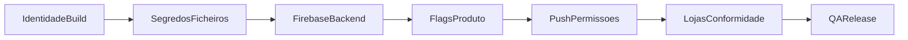

# Whenote — Checklist e configuração para produção

Este documento reúne **tudo o que precisa de estar definido** para compilar, publicar e operar o app em **modo produção**: ficheiros locais, variáveis de build (`dart-define`), Firebase, Meta/Instagram, billing opcional, assinaturas móveis e referências ao resto da documentação. A **checklist acionável** (por fases A–G) está na [secção 8](#8-checklist-de-produção-completa).

**Relacionado:** [README.md](../README.md) (Firebase, CLI), secção [9](#9-testes-em-dispositivo-real-qa) (QA em dispositivo), [TROUBLESHOOTING.md](TROUBLESHOOTING.md) (envio de carta, `permission-denied`, ecrã admin), [ARCHITECTURE.md](ARCHITECTURE.md) (stack, moderação, Instagram Stories), [functions/README.md](../functions/README.md) (Stripe, moderação por IA e Cloud Functions).

---

> ### ⚠️ ATENÇÃO — Custos Firebase antes de lançar em produção
>
> **Antes de publicar o app nas lojas**, é **obrigatório** compreender a estrutura de custos do Firebase para evitar surpresas na faturação. O plano gratuito (Spark) tem limites apertados que são facilmente ultrapassados com utilizadores reais. Ao escalar para o plano **Blaze** (pay-as-you-go), os custos podem crescer rapidamente se não forem monitorizados.
>
> **Pontos críticos a analisar:**
>
> 1. **Firestore** — leituras, escritas e eliminações são cobradas por operação. Listeners em tempo real (streams) contam como leituras a cada alteração. Atenção especial ao feed público (queries com `limit`), ao separador "Seguindo" (até `ceil(n/10)` queries por atualização) e a qualquer listener que dispare em loop ou sem `limit`.
> 2. **Cloud Functions** — invocações, tempo de CPU e memória são cobrados. Funções de moderação por IA (`moderateContent`) e webhooks (`onSendGridWebhook`) podem escalar com o volume de cartas enviadas.
> 3. **Storage** — armazenamento de imagens (avatares, cartas) e bandwidth de download. Considerar compressão e limites de upload.
> 4. **Authentication** — gratuito para a maioria dos métodos, mas verificações por SMS (se usadas) são cobradas.
> 5. **Hosting** — bandwidth e armazenamento; normalmente baixo, mas picos de tráfego podem surpreender.
>
> **Ações recomendadas antes do lançamento:**
>
> - [x] ~~Ativar **Budget Alerts** na Google Cloud Console~~ — ✅ Configurado 2026-05-01: €20/mês, alertas 50/80/100%, email para admins + project owners.
> - [ ] Rever a [calculadora de preços do Firebase](https://firebase.google.com/pricing) com estimativas realistas de utilizadores ativos diários (DAU) e operações por sessão.
> - [x] ~~Ativar o **Firebase Usage dashboard**~~ — ✅ Já ativo (plano Blaze). Verificado 2026-05-01: $0.00, Firestore <1% do quota gratuito. Monitorizar diariamente na primeira semana pós-lançamento.
> - [ ] Considerar **App Check** para reduzir abuso (bots, scraping) que inflaciona custos desnecessariamente.
> - [ ] Documentar estimativas e limites aceitáveis em [`planning/custos/GASTOS.md`](custos/GASTOS.md).
>
> **Sem esta análise, NÃO avançar para produção.** Um pico inesperado de utilizadores ou um bug que gere leituras em loop pode resultar em custos elevados em poucas horas.

---

## 1. Ficheiros obrigatórios no cliente (Firebase)

| Ficheiro | Função |
|----------|--------|
| `lib/firebase_options.dart` | Configuração FlutterFire (todas as plataformas). **Obrigatório** para correr o app. |
| `android/app/google-services.json` | Projeto Firebase Android. |
| `ios/Runner/GoogleService-Info.plist` | Projeto Firebase iOS. |

Neste repositório, os três ficheiros estão **versionados** para o projeto **`whenote-923f5`**. Sem eles (ou sem versões coerentes entre si), o build ou o runtime Firebase falham. Para **outro** projeto Firebase (ou após mudar bundle IDs / package name), regenerar com [FlutterFire CLI](https://firebase.flutter.dev/docs/cli/) alinhado ao projeto de produção.

Identificadores do projeto atual estão descritos em [README.md](../README.md#firebase-configuration) (tabela Project identifiers).

---

## 2. Variáveis de build Flutter (`--dart-define`)

O código lê constantes em tempo de compilação. **Passar todas as que forem necessárias** no mesmo comando de build/release (CI incluído).

| Variável | Obrigatória? | Valor típico / default | Onde é usada |
|----------|----------------|-------------------------|--------------|
| `FB_APP_ID` | **Recomendada** para partilha nativa Instagram Stories | Meta (Facebook) **App ID** numérico | [`lib/core/config/facebook_app_config.dart`](../lib/core/config/facebook_app_config.dart) |
| `BILLING_ENABLED` | Não (default `false`) | `true` só quando Stripe + Functions estão prontos | [`lib/core/billing/billing_feature_flags.dart`](../lib/core/billing/billing_feature_flags.dart) |
| `FUNCTIONS_REGION` | Não | Default `us-central1`; alterar se as Cloud Functions estiverem noutra região | [`lib/core/billing/firebase_functions_region.dart`](../lib/core/billing/firebase_functions_region.dart) |

### Comportamento se não definir

- **`FB_APP_ID` em falta:** a partilha para Instagram Stories continua a funcionar via **fallback** (folha de partilha do sistema com PNG + texto). O fluxo **nativo** (abrir diretamente o Instagram Stories) **não** é usado.
- **`BILLING_ENABLED` omitido ou `false`:** não há chamadas a checkout/portal Stripe; evita erros até billing estar configurado.
- **`FUNCTIONS_REGION` omitido:** usa-se `us-central1` para chamadas `cloud_functions` (billing, moderação, admin).

### Exemplos de comando

```bash
# Desenvolvimento com Instagram nativo (substituir pelo App ID real)
flutter run --dart-define=FB_APP_ID=1234567890123456

# Release APK com Instagram + billing ativo (exemplo)
flutter build apk --release \
  --dart-define=FB_APP_ID=1234567890123456 \
  --dart-define=BILLING_ENABLED=true \
  --dart-define=FUNCTIONS_REGION=us-central1
```

```bash
# iOS release (ajustar signing no Xcode / CI)
flutter build ios --release \
  --dart-define=FB_APP_ID=1234567890123456
```

**CI/CD:** definir as mesmas variáveis no pipeline (Codemagic, GitHub Actions, etc.) para não publicar builds de loja sem `FB_APP_ID` se quiserem o fluxo nativo Instagram.

**Segurança:** o **App ID** de cliente é tratado como público (como em SDKs). **Nunca** colocar **App Secret** ou chaves Stripe no código Dart — apenas em servidor / Cloud Functions (ver [`functions/README.md`](../functions/README.md)).

---

## 3. Instagram / Meta (Facebook App ID)

1. Criar ou usar uma app no [Meta for Developers](https://developers.facebook.com/) com o produto **Instagram** / **Sharing to Stories** conforme a [documentação atual](https://developers.facebook.com/docs/instagram/sharing-to-stories/).
2. Copiar o **Facebook App ID** (número) e injetá-lo como `FB_APP_ID` no build (secção 2).
3. O repositório já inclui:
   - **iOS:** `LSApplicationQueriesSchemes` para `instagram` e `instagram-stories` em `Info.plist`.
   - **Android:** `FileProvider`, `<queries>` para `com.instagram.android`, intent `com.instagram.share.ADD_TO_STORY`.

Revalidar após mudanças de política da Meta (ver notas em [ARCHITECTURE.md](ARCHITECTURE.md) — secção “Partilha social / Instagram Stories”).

---

## 4. Firebase (produção)

**Checklist rápido — `firebase deploy` vs lojas:** `npx -y firebase-tools@latest deploy` na raiz (ver [`firebase.json`](../firebase.json)) publica **Hosting** (estáticos em `hosting/public`), **Cloud Functions**, **regras e índices Firestore** e **regras Storage** — não envia binários iOS/Android. Para TestFlight, App Store e Google Play, ver [secção 7](#7-assinatura-e-publicação-nas-lojas-resumo).

| Ação | Comando / nota |
|------|----------------|
| Deploy de regras Firestore e Storage | `firebase deploy --only firestore:rules,storage` (e índices se necessário: `firestore:indexes`) |
| Validar permissões | Garantir que fluxos principais não devolvem `PERMISSION_DENIED` (ver secção [9](#9-testes-em-dispositivo-real-qa)) |
| **`permission-denied` ao enviar carta** | Regras em `firestore.rules` (cartas, `users`, `badgeUnlocks`) devem estar deployadas e alinhadas ao repo; ver [TROUBLESHOOTING.md](TROUBLESHOOTING.md) §1 |
| **`systemConfig/app`** | Documento de flags remotas: `reportsEnabled`, `aiModerationEnabled`, `aiModerationFailClosed`, etc. Criar/editar na consola ou Admin SDK (o cliente não escreve). Ver [ARCHITECTURE.md](ARCHITECTURE.md) (secção “Config remota”). |

### Domínio personalizado

O domínio **`whenote.app`** está registado na **Cloudflare** (DNS gerido lá) e conectado ao **Firebase Hosting**. Serve as páginas públicas (`privacy.html`, `terms.html`, `support.html`), o `assetlinks.json` (Android App Links) e resolve deep links (`/letter/...`, `/capsule/...`). Se necessário reconfigurar: Firebase Console → Hosting → Custom domain; Cloudflare → DNS → registos CNAME/A conforme instruções do Firebase.

**Emails:** 7 endereços do domínio (`privacy@`, `privacidade@`, `suporte@`, `dpo@`, `juridico@`, `info@`, `noreply@`) estão configurados via **Cloudflare Email Routing** e redirecionam para `y.m.lima19@gmail.com`. O `noreply@whenote.app` é também o remetente padrão do SendGrid (Cloud Functions). Configuração: Cloudflare Dashboard → Email → Email Routing → Custom addresses.

Detalhes de projeto, CLI e emuladores: [README.md](../README.md#firebase-configuration).

### Firestore — custo e padrões

| Área | Nota |
|------|------|
| **Feed público** | Query com `limit` + janela em `openedAt` ([`feed_config.dart`](../lib/core/constants/feed_config.dart)); evita leituras globais ilimitadas. **Explorar:** primeira página em stream + mais páginas com `get()` + `startAfter` ao fazer scroll (custo por página extra). **Destaques:** mesma query limitada; ordenação por engajamento só no cliente, com teto de documentos. **Seguindo:** até **ceil(n/10)** queries/listeners por atualização (n = contas seguidas), por limite `whereIn` do Firestore — monitorizar em contas com muitos follows. |
| **Busca (lista de utilizadores)** | [`UserSearchService`](../lib/core/user_search/user_search_service.dart) — **não** há `get()` na coleção `users` para pesquisa; usa queries com `limit` (prefixo em `username` + `searchTokens` com `array-contains`). **Até ~abril/2026** o cliente carregava todos os documentos de `users` — ver [`CHANGELOG.md`](CHANGELOG.md). Seguir/Seguindo na tela Buscar: leituras em **batch** (`whereIn` em chunks), não um listener por linha. Pull-to-refresh com throttle (~3 s). Utilizadores sem `searchTokens` (dados antigos) continuam encontráveis por prefixo de `@username` até guardarem o perfil. |
| **Exportação (Pro)** | Cartas apenas onde o utilizador é remetente ou destinatário e `status == opened`; links `musicUrl` validados com allowlist ([`music_url.dart`](../lib/shared/utils/music_url.dart)). |

### Manutenção periódica

- [ ] **Domínio `whenote.app`:** verificar estado de renovação no Cloudflare (expira 10 de abril de 2027). Activar auto-renew.
- [ ] **Certificados SSL:** geridos automaticamente pelo Cloudflare/Firebase Hosting — verificar se não há alertas.
- [ ] **Secrets Firebase:** rotação de `OPENAI_API_KEY` e `SENDGRID_API_KEY` se comprometidas.

---

## 5. Cloud Functions — billing (Stripe) e moderação por IA

- **Stripe:** variáveis de **runtime** no Google Cloud (tabela em **[`functions/README.md`](../functions/README.md)**). No **cliente**, billing só com `--dart-define=BILLING_ENABLED=true` quando Stripe e funções estiverem prontos.
- **Descrição do produto para onboarding Stripe (KYC):** texto curto/long em inglês (e referência em PT) em **[`planning/BUSINESS.md`](BUSINESS.md)** — secção *“Texto para onboarding Stripe”* — alinhado a assinaturas (tiers **Amanhã** / **Brisa** / **Horizonte**), Checkout + Portal, e serviços digitais apenas.
- **Moderação por IA:** `OPENAI_API_KEY` e opcionalmente `MODERATION_PROVIDER` nas mesmas Functions; o cliente chama `moderateContent` quando `aiModerationEnabled` é `true` em **`systemConfig/app`**. Sem chave, o servidor aplica fallback conforme `aiModerationFailClosed` e regista incidentes em `moderationIncidents`. Superadmin vê provedor e estado das credenciais via `adminGetModerationInfo` (app **Configurações → Moderação**). Detalhes: [ARCHITECTURE.md](ARCHITECTURE.md), [functions/README.md](../functions/README.md).
- **Região:** alinhar `FUNCTIONS_REGION` no build Flutter com a região deployada (`us-central1` por defeito).

### SendGrid — webhook de email bounce

Para que o app receba notificações de bounce/dropped dos emails de convite para destinatários externos:

1. ✅ **Instalar dependência:** `cd functions && npm install @sendgrid/eventwebhook`
2. ✅ **Secrets Firebase (Functions v2):**
   - `firebase functions:secrets:set SENDGRID_API_KEY` — migrado de `.env` para Secret Manager (2026-04-11). **Atenção:** `SENDGRID_API_KEY` **não pode** estar em `functions/.env` e no Secret Manager ao mesmo tempo — Cloud Run rejeita com "Secret environment variable overlaps non secret environment variable".
   - `firebase functions:secrets:set SENDGRID_WEBHOOK_VERIFICATION_KEY` — copiar do painel SendGrid (passo 4)
3. ✅ **Deploy:** `firebase deploy --only functions`
4. ✅ **Painel SendGrid** → Settings → Mail Settings → Event Webhook:
   - Nome: "Whenote Email Events"
   - URL: `https://us-central1-whenote-923f5.cloudfunctions.net/onSendGridWebhook`
   - Eventos: Bounced, Dropped, Deferred, Delivered
   - **Signed Event Webhook** habilitado (verification key copiada para o passo 2)
   - Webhook ID: `a25e23d6-27fd-4b54-bca3-e82e7857cb43`
5. ✅ **Deploy rules:** `firebase deploy --only firestore:rules` (campos imutáveis protegidos)
6. ✅ **`preferredLanguage`:** campo sincronizado com Firestore via `locale_provider.dart` quando o utilizador muda o idioma; incluído na criação de conta. Webhook faz fallback: `preferredLanguage` → `language` (2 chars) → `"en"`.

Cloud Functions envolvidas: `onSendGridWebhook` (webhook HTTP), `onLetterCreatedSendExternalInviteEmail` (trigger Firestore), `resendExternalInviteEmail` (callable com rate limiting). Detalhes: [ARCHITECTURE.md](ARCHITECTURE.md) (secção "Entrega de email externo") e [`EMAIL_VALIDATION_PLAN.md`](EMAIL_VALIDATION_PLAN.md).

**Webhook URL:** `https://us-central1-whenote-923f5.cloudfunctions.net/onSendGridWebhook`
**Webhook ID (SendGrid):** `a25e23d6-27fd-4b54-bca3-e82e7857cb43`

### Email de autenticação (SMTP + templates + página de ação)

Configuração inicial feita em 2026-04-12 (SendGrid). **Migrado para Google Workspace SMTP Relay em 2026-04-26.**

**Estado atual (desde 2026-04-26):**

| Componente | Estado | Detalhe |
|------------|--------|---------|
| **Google Workspace SMTP Relay** | ✅ Configurado | `smtp-relay.gmail.com:587` STARTTLS |
| **Sender address** | ✅ `noreply@whenote.com` | Remetente dos emails de auth |
| **SMTP username** | ✅ `yurilima@whenote.com` | Conta Workspace com 2FA ativa |
| **SMTP password** | ✅ App Password | `vpjt xycl yqvt kcmv` (gerada em myaccount.google.com → App Passwords, nome "Firebase SMTP") |
| **Workspace Admin** | ✅ Relay ativado | Admin Console → Apps → Gmail → Routing → "Firebase Auth SMTP Relay" |
| **Action URL (global)** | ✅ Configurada | `https://whenote.app/auth/action.html` (aplica-se a todos os templates) |
| **Sender name** | ✅ "Whenote" | Nos 3 templates: verification, password reset, email change |
| **Página de ação** | ✅ Concluído | `hosting/public/auth/action.html` — dark theme com branding |

**Configuração do SMTP relay no Google Workspace Admin Console:**

- **Caminho:** `admin.google.com/u/1/` → Apps → Google Workspace → Gmail → Routing → SMTP relay service
- **Regra:** "Firebase Auth SMTP Relay"
- **Allowed senders:** Any addresses — necessário para Firebase (endereço externo)
- **Require SMTP Authentication:** ✅
- **Require TLS encryption:** ✅

**Limite:** ~2.000 emails/dia (Workspace). Se exceder, considerar serviço dedicado.

**Se a App Password expirar:** gerar nova em `myaccount.google.com/u/1/apppasswords` (requer 2FA) e atualizar no Firebase Console → Authentication → Templates → SMTP Settings.

> **Histórico:** anteriormente usava SendGrid (`smtp.sendgrid.net`, username `apikey`, domínio `em2352.whenote.app`). Migrado para simplificar stack e eliminar dependência externa.

**Redirect pós-registro:** corrigido em [`register_screen.dart`](../lib/features/auth/presentation/screens/register_screen.dart) — `Navigator.popUntil` após criação da conta para que o `AuthWrapper` redirecione à `HomeScreen`.

**Ficheiros criados/modificados:**

| Ficheiro | Descrição |
|----------|-----------|
| `hosting/public/auth/action.html` | Página de ação customizada (verifica email, reset password) — dark theme |
| `hosting/email-templates/verify-email.html` | Template SendGrid — verificação de email |
| `hosting/email-templates/reset-password.html` | Template SendGrid — reset de senha |
| `firebase.json` | Headers `no-cache` / `nosniff` / `DENY` para `auth/**` |
| `lib/features/auth/presentation/screens/register_screen.dart` | Fix: `popUntil` pós-registro |
| `planning/EMAIL_SETUP.md` | Guia completo de configuração |

### Nota (futuro): filas e workers

Não é requisito atual. Se um dia aparecerem **trabalhos pesados ou longos**, **filas com requisitos fortes** (ordem, retries elaborados, throughput alto) ou **integração fora do ecossistema Firebase/GCP**, vale relembrar: no Google Cloud o caminho habitual é **Pub/Sub** + subscribers (Cloud Functions ou Cloud Run), **Cloud Tasks** para tarefas adiadas com retries, e **Cloud Scheduler** para cron. **RabbitMQ** (ou outra fila AMQP) e **workers** dedicados só fazem sentido quando houver necessidade explícita ou equipa/infra já orientada a isso — acrescentam operação e integração extra face ao stack atual.

---

## 6. Notificações push (FCM)

- **iOS:** conta Apple Developer, capability **Push Notifications** no Xcode, APNs configurado no Firebase Console (ver secção [9](#9-testes-em-dispositivo-real-qa)).
- **Android:** `POST_NOTIFICATIONS` em Android 13+; testar em dispositivo real.

---

## 7. Assinatura e publicação nas lojas (resumo)

| Plataforma | O que verificar |
|------------|-----------------|
| **Android** | Keystore de release, `applicationId` / `namespace` em `build.gradle.kts`, Play Console (ficheiros de política, screenshots). |
| **iOS** | Certificados e perfis no Apple Developer, **Signing & Capabilities** no Xcode, App Store Connect. **Metadata configurado (2026-04-26):** descrição, keywords, texto promocional, subtítulo, URLs (suporte + marketing), copyright, categorias (Social Networking + Lifestyle), age ratings 4+ (UGC = YES), pricing Free em 175 países, contacto de revisão. **Pendente:** screenshots (mín. 3 iPhone 6.5"). *(Build IPA, test account App Review e deploy hosting com `support.html` tratados.)* |

Comandos específicos de build seguem a documentação oficial do Flutter; as variáveis `dart-define` da secção 2 aplicam-se a **todos** os `flutter build` de release.

---

## 8. Checklist de produção (completa)

Use esta lista como roteiro antes de submeter builds às lojas ou de declarar o ambiente “produção”. Detalhes e comandos estão nas secções [1](#1-ficheiros-obrigatórios-no-cliente-firebase)–[7](#7-assinatura-e-publicação-nas-lojas-resumo); regressão em dispositivo: secção [9](#9-testes-em-dispositivo-real-qa); critérios MVP: [MVP_CHECKLIST.md](MVP_CHECKLIST.md).

**Ordem sugerida:** A (identidade e build) → B (segredos e ficheiros) → C (Firebase e backend) → D (flags de produto) → E (push) → F (lojas e conformidade) → G (QA final).



### A. Identidade e build

- [ ] **Bundle ID** (iOS) e **`applicationId`** / `namespace` (Android) finais; registados no Firebase, App Store Connect e Google Play Console.
- [ ] Após alterar identificadores: regenerar **`firebase_options.dart`** e ficheiros nativos (`google-services.json`, `GoogleService-Info.plist`) com [FlutterFire CLI](https://firebase.flutter.dev/docs/cli/) alinhado ao projeto de produção (ver secção [1](#1-ficheiros-obrigatórios-no-cliente-firebase)).
- [ ] **Keystore** de release Android configurado e `signingConfigs` de **release** a apontar para esse keystore (não usar apenas a assinatura debug em builds de loja; ver secção [7](#7-assinatura-e-publicação-nas-lojas-resumo)).
- [ ] **`pubspec.yaml`:** `version` (`nome+build`) atualizado para a submissão (version code Android / build number iOS).
- [ ] Comandos **`flutter build … --release`** incluem todos os `--dart-define` necessários (secção [2](#2-variáveis-de-build-flutter---dart-define)); CI/CD com as mesmas variáveis.

### B. Segredos e ficheiros locais

- [ ] `lib/firebase_options.dart`, `android/app/google-services.json`, `ios/Runner/GoogleService-Info.plist` presentes e alinhados ao **projeto Firebase de produção** (secção [1](#1-ficheiros-obrigatórios-no-cliente-firebase)).
- [ ] Nenhum **segredo** de servidor (Stripe secret, OpenAI, etc.) no código cliente ou no repositório público — apenas em Cloud Functions / ambiente seguro ([`functions/README.md`](../functions/README.md)).

### C. Firebase e backend

- [x] **⚠️ Análise de custos Firebase concluída** — Budget Alerts configurados na Google Cloud Console (€20/mês, alertas 50/80/100%, email para admins + project owners — 2026-05-01). Estimativas de custo por DAU e Firebase Usage dashboard pendentes.
- [ ] `firebase deploy` de **Firestore rules**, **Storage rules** e **índices** (`firestore:indexes` se aplicável) validado em staging e repetido para produção (secção [4](#4-firebase-produção)).
- [ ] Documento **`systemConfig/app`** em Firestore criado/revisado (`reportsEnabled`, `aiModerationEnabled`, `aiModerationFailClosed`, etc.) conforme [ARCHITECTURE.md](ARCHITECTURE.md).
- [ ] **Cloud Functions:** variáveis de runtime (Stripe, moderação) configuradas no Google Cloud; `firebase deploy --only functions` após alterar envs quando necessário (secção [5](#5-cloud-functions--billing-stripe-e-moderação-por-ia)).

### D. Funcionalidades e flags de build

- [ ] **`FB_APP_ID`** definido nos builds que devem usar Instagram Stories **nativo**, ou decisão explícita de aceitar só o **fallback** (folha de partilha; secções [2](#2-variáveis-de-build-flutter---dart-define) e [3](#3-instagram--meta-facebook-app-id)).
- [ ] Se **billing** ativo: `BILLING_ENABLED=true`, `FUNCTIONS_REGION` igual à região deployada, envs Stripe nas Functions (secção [5](#5-cloud-functions--billing-stripe-e-moderação-por-ia)).
- [ ] Se **moderação por IA** ativa: `OPENAI_API_KEY` (e `MODERATION_PROVIDER` se não for o default) nas Functions; flags em `systemConfig/app` coerentes; deploy de functions após mudanças (secção [5](#5-cloud-functions--billing-stripe-e-moderação-por-ia)).

### E. Push e permissões

- [ ] **iOS:** capability **Push Notifications**, APNs ligado ao Firebase Console (secção [6](#6-notificações-push-fcm)).
- [ ] **Android 13+:** fluxo de permissão de notificações testado em dispositivo real (secção [6](#6-notificações-push-fcm)).

### F. Lojas e conformidade

- [x] URLs de **política de privacidade** e **termos de utilização** prontas e indicadas nas fichas (Play Console e App Store Connect); texto de negócio/alinhamento em [BUSINESS.md](BUSINESS.md) se aplicável.
- [ ] **Google Play:** formulário Data safety, classificação de conteúdo, ícones e screenshots conforme políticas atuais.
- [x] **App Store Connect — metadata iOS 1.0:** descrição, keywords, texto promocional, subtítulo, URLs (suporte `whenote.app/support` + marketing `whenote.app`), copyright, categorias (Social Networking + Lifestyle), age ratings 4+ (UGC = YES), pricing Free 175 países, contacto de revisão preenchido.
- [ ] **App Store — screenshots:** mínimo 3 para iPhone 6.5" (obrigatório para submissão).
- [x] **App Store — build IPA:** build 17 enviado via Transporter e visível no TestFlight.
- [x] **App Store — test account:** credenciais de login de teste para a equipa de revisão Apple (Sign-in required marcado).
- [x] **Firebase Hosting deploy:** `firebase deploy --only hosting` para publicar `support.html` (URL de suporte na ficha da App Store).
- [ ] **App Store:** questionário de privacidade da app; rever **`Info.plist`**: textos de uso (câmera, localização, microfone, etc.) coerentes com o comportamento real; **`UIBackgroundModes`** apenas com modos efetivamente necessários (evita perguntas extra na revisão).

### G. QA antes do release

- [ ] Regressão em **dispositivos reais** iOS e Android conforme secção [9](#9-testes-em-dispositivo-real-qa) (login, feed, cofre, cartas/cápsulas, localização, push, Instagram conforme build).
- [ ] Se aplicável ao release, critérios [MVP_CHECKLIST.md](MVP_CHECKLIST.md) verificados.

---

## 9. Testes em dispositivo real (QA)

> **Problemas conhecidos:** antes de iniciar QA, consultar [TROUBLESHOOTING.md](TROUBLESHOOTING.md) para workarounds de problemas conhecidos (ex.: §2 SIGABRT no admin iOS, §1 permission-denied ao enviar carta).

**Configuração de build para produção** (variáveis `dart-define`, ficheiros Firebase, Instagram): ver secções [1](#1-ficheiros-obrigatórios-no-cliente-firebase) a [3](#3-instagram--meta-facebook-app-id).

Checklist para validar iOS/Android em **regressão** ao publicar releases (fluxos críticos do MVP já implementados — ver [`MVP_CHECKLIST.md`](MVP_CHECKLIST.md)).

### Pré-requisitos

- Flutter SDK e Xcode (iOS) / Android Studio (Android)
- Arquivos locais: `lib/firebase_options.dart`, `android/app/google-services.json`, `ios/Runner/GoogleService-Info.plist`
- Conta Apple Developer para push em iOS (APNs configurado no Firebase Console)
- Checklist completa antes de produção / lojas: secções [1](#1-ficheiros-obrigatórios-no-cliente-firebase)–[7](#7-assinatura-e-publicação-nas-lojas-resumo) (Ficheiros Firebase, Variáveis, Instagram, Firebase, Cloud Functions, Push, Lojas)

### Android

1. `flutter pub get`
2. Conectar dispositivo com USB debugging ou usar emulador com Play Services
3. `flutter run` (ou `flutter build apk --release` + instalar APK)
4. Confirmar permissões: notificações (Android 13+), galeria para foto de perfil, **localização** ao criar carta/cápsula com partilha de GPS e ao abrir com `openRequiresProximity` (deve pedir localização no destinatário)
5. Fluxos mínimos: login → feed → cofre → criar carta/cápsula **com** e **sem** localização / **com** restrição de 10 m → abrir no local e longe do ponto → perfil → alterar foto → configurações → permissão de push
6. **Instagram Stories:** build com `--dart-define=FB_APP_ID=…` (Meta App ID). Instalar **Instagram** no dispositivo. Abrir detalhe de carta ou cápsula → partilhar → confirmar que a app Instagram abre no fluxo de Stories (ou, sem Instagram, que a folha de partilha mostra o PNG). Repetir no ecrã de QR Code (botão "Instagram Stories").

### iOS

1. No iPhone: **Ajustes → Privacidade e segurança → Modo de desenvolvedor** (Developer Mode) ligado, e confiar no Mac quando o Xcode/cabo pedir.
2. Abrir `ios/Runner.xcworkspace` no Xcode e definir **Signing & Capabilities** (time + bundle id)
3. Adicionar capability **Push Notifications** se ainda não existir (FCM)
4. `flutter run` em dispositivo físico (push não valida no simulador da mesma forma)
5. Na primeira execução, aceitar alertas de fotos, notificações e **localização** quando testar envio com GPS ou abertura com proximidade
6. Repetir os mesmos fluxos do Android (incluindo localização nos fluxos de carta/cápsula)
7. **Instagram Stories:** igual ao passo 6 do Android (`FB_APP_ID` + app Instagram instalada)

### Firebase (produção)

- Deploy das regras após QA em staging:  
  `firebase deploy --only firestore:rules,storage`
- Validar que leituras/escritas do app não retornam `PERMISSION_DENIED` nos fluxos acima

**Documentação completa:** identificadores do projeto, instalação da Firebase CLI, JDK 21 para Emulator Suite, portas e deploy — ver [README.md](../README.md#firebase-configuration) (English) ou `README.pt-BR.md` (seções *Configuração Firebase* e *Firebase CLI e emuladores*).

**Problemas com envio de carta ou ecrã admin moderação:** [TROUBLESHOOTING.md](TROUBLESHOOTING.md).

### Regressão web (opcional)

- `flutter run -d chrome` — avatar (galeria), abertura de cápsula e feed continuam funcionando; FCM no web exige configuração extra (VAPID / service worker) e pode estar limitado.

---

## 10. Histórico de alterações deste guia

- **2026-05-01:** Firebase Hosting — `firebase deploy --only hosting` concluído; `support.html` e rota `/support` em produção (`whenote.app/support`).
- **2026-04:** Página de suporte (`support.html`) adicionada ao Firebase Hosting; App Store Connect iOS 1.0 configurado (metadata, pricing, age ratings); checklist F expandida com itens pendentes (screenshots, build, test account, deploy hosting).
- **2026-04:** DEVICE_TESTING.md absorvido na secção [9](#9-testes-em-dispositivo-real-qa); referências cruzadas atualizadas; secção "Histórico" renumerada para §10.
- **2026-03:** secção [8](#8-checklist-de-produção-completa) expandida em checklist A–G (identidade/keystore, segredos, Firebase, flags, push, lojas, QA); diagrama de ordem sugerida; referências cruzadas a DEVICE_TESTING e MVP_CHECKLIST.
- **2026-03:** nota futura “filas e workers” (Pub/Sub, Cloud Tasks, RabbitMQ) na secção 5.
- **2026-03 (feed):** tabela “Firestore — custo” alargada com Explorar (paginação), Destaques (sort no cliente) e Seguindo (custo `ceil(n/10)`).
- **2026-03:** documento criado para consolidar `FB_APP_ID`, `BILLING_ENABLED`, `FUNCTIONS_REGION` e requisitos Firebase/lojas.
- **2026-03 (moderação IA):** secção 5 alargada (Stripe + moderação); Firestore `systemConfig/app`; checklist com IA; relações com ARCHITECTURE / functions README.
- **2026-04:** domínio `whenote.app` (Cloudflare → Firebase Hosting) documentado na secção 4.
